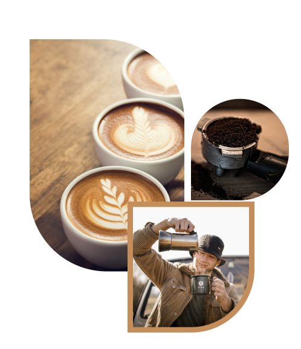

# Play - Free HTML Template for Startup, Apps and SaaS

<!-- =========

	Template Name: Play
	Author: UIdeck
	Author URI: https://uideck.com/
	Support: https://uideck.com/support/
	Version: 1.1

========== -->
<!-- Primary Meta Tags -->
<meta name="title" content="NothingCoffee">
<meta name="description" content="Venta y suscripción de cafe de grano y cápsula">

<!-- Open Graph / Facebook -->
<meta property="og:type" content="website">
<meta property="og:url" content="https://versuscodex.github.io/index.html">
<meta property="og:title" content="NothingCoffee">
<meta property="og:description" content="Play - Free Open Source HTML Bootstrap Template by UIdeck Team">
<meta property="og:image" content="https://uideck.com/wp-content/uploads/2021/09/play-meta-bs.jpg">

<!-- Twitter -->
<meta property="twitter:card" content="summary_large_image">
<meta property="twitter:url" content="https://versuscodex.github.io/index.html">
<meta property="twitter:title" content="NothingCoffee">
<meta property="twitter:description" content="Venta y suscripción de cafe de grano y cápsula">
<meta property="twitter:image" content="https://uideck.com/wp-content/uploads/2021/09/play-meta-bs.jpg">

### This template crafted using 🥞 [TailGrids](https://tailgrids.com/) UI components (design)

### [🚀 View Demo](https://preview.uideck.com/items/play-bootstrap/)

### [⬇️ Download Now](https://links.uideck.com/play-bootstrap-download)
    <!-- ===== All CSS files ===== -->
    <link rel="stylesheet" href="assets/css/bootstrap.min.css" >
    <link rel="stylesheet" href="assets/css/animate.css" >
    <link rel="stylesheet" href="assets/css/lineicons.css" >
    <link rel="stylesheet" href="assets/css/ud-styles.css" >
    <link rel="stylesheet" href="assets/css/style.css">

    <!--====== Favicon Icon ======-->
    <link
      rel="shortcut icon"
      href="assets/images/Nothing_coffe_negro_favicon.svg"
      type="image/svg"
    >

Accesibilidad

    En éste enlace validamos nuestro html de la tienda en validator.w3.org
    https://validator.w3.org/nu/?doc=https%3A%2F%2Fversuscodex.github.io%2Findex.html

    Diseño web responsive: La página está diseñada para ser accesible desde diferentes dispositivos y tamaños de pantalla, incluyendo teléfonos móviles, tabletas y ordenadores de escritorio.
    Navegación intuitiva: La navegación en la página es sencilla e intuitiva, para que los usuarios puedan encontrar fácilmente lo que están buscando. Tenemos un menú claro y fácil de usar que puede ayudar a mejorar la experiencia del usuario.
    Texto claro y legible: Todo el texto de la página está escrito en una fuente fácil de leer y cuenta con un alto contraste con el fondo, lo que hace que sea fácil de leer para todas las personas, independientemente de su capacidad visual.
    Formularios accesibles: Todos los formularios de la página, incluyendo aquellos para la suscripción o para realizar compras, son accesibles. Esto incluye etiquetas claras para los campos de entrada, retroalimentación clara para los errores y la capacidad de navegar fácilmente entre los campos.
    Estructura clara de la página: La página cuenta con una estructura clara y organizada, que hace que la navegación sea fácil e intuitiva para todas las personas. Los encabezados y subtítulos se utilizan para organizar la información.
    Alternativas de texto: Todos los videos y otros elementos multimedia de la página cuentan con alternativas de texto, que permiten a las personas que utilizan lectores de pantalla acceder a esta información.

Usabilidad.

    Diseño limpio y simple: Hemos intentado que nuestra página web de la empresa del café tenga un diseño limpio y simple, con una fácil navegación y sin demasiados elementos distractivos. Los colores que hemos elegido son  atractivos y están en concordancia con el producto que estamos vendiendo. En éste apartado hacemos referencia a la regla número ocho de "10 reglas heurísticas de Nielsen y cómo aplicarlas".

    Fácil de navegar: Una navegación intuitiva. Los botones de navegación están claramente etiquetados y ubicados en lugares estratégicos. Por ejemplo, el botón de "Comprar" es fácilmente visible en la página principal en la esquina superior derecha.

    Información clara: La página web tiene información clara sobre los productos de café que vendemos, tales como los precios, la imagen del producto y recomendaciones de los clientes. La información de contacto y ubicación de la empresa es muy fácil de encontrar, concretamente en la pestaña de “Contacto” en la parte superior .

    Reseñas de clientes: Las reseñas de clientes pueden ayudar a los nuevos compradores a tomar una decisión de compra. En nuestro caso está en la pestaña de “Suscripciones” para que los clientes escriban sus comentarios y valoraciones.

    Responsive design: Como hemos mencionado antes en el apartado de accesibilidad, ya que comparten algunas normas en común. La página web de NothingCoffee se adapta a diferentes tamaños de pantalla. De esta manera, los usuarios pueden navegar fácilmente desde su computadora, tablet o teléfono móvil.

## 📃 License
Play is an open-source template, you can use it with your personal or commercial projects without any attribution or backlink.

Declaración 
Esta obra está bajo una licencia de Creative Commons Reconocimiento-NoComercial 4.0 Internacional.
Hemos elegido la licencia porque queremos que se comparta las adaptaciones de nuestra página web pero no queremos que se use en el plano comercial ya que somos una empresa con ánimo de lucro.

Imágenes:

Utilizada para el fondo de inicio:
	“Imagen de Granos de café, Comida y Textura” por StockSnap licenciado bajo Licencia de Pixabay https://pixabay.com/es/photos/granos-de-caf%c3%a9-comida-textura-926837/

Utilizada en la sección "qué ofrecemos":
	“Molinillo De Café, Café y Polvo” por Artturi_Mantysaari licenciado bajo Licencia de Pixabay https://pixabay.com/es/photos/molinillo-de-cafe-caf%c3%a9-polvo-2138170/ 

	“Imagen de Café, Frijoles y Granos de café” por felix_w licenciado bajo Licencia de Pixabay https://pixabay.com/es/photos/caf%c3%a9-frijoles-granos-de-caf%c3%a9-4310674/ 

	“Imagen de Café, Taza y Cafeína” por 13758299 licenciado bajo Licencia de Pixabay https://pixabay.com/es/photos/caf%c3%a9-taza-cafe%c3%adna-caf%c3%a9-expr%c3%a9s-4618705/ 

    “Imagen de Café , Hombre y Exterior” por Timmyspics licenciado bajo Licencia de Pixabay https://pixabay.com/es/photos/caf%c3%a9-hombre-exterior-ma%c3%b1ana-5016043/ 

	“Imagen de Café, Café molido y Cafetera” por jarmoluk licenciado bajo Licencia de Pixabay https://pixabay.com/es/photos/caf%c3%a9-caf%c3%a9-molido-cafetera-424763/ 

	“Imagen de Cafetería, Estética vintage y Cafetera” por bbom100892 licenciado bajo Licencia de Pixabay https://pixabay.com/es/photos/cafeter%c3%ada-est%c3%a9tica-vintage-cafetera-7454951/ 

	“Imagen de Mujer, Café y Teléfono” por Averyanovphoto licenciado bajo Licencia de Pixabay https://pixabay.com/es/photos/mujer-caf%c3%a9-tel%c3%a9fono-retrato-dama-4246954/ 

Utilizadas en blog:

    -”Imagen de Coffee break, Conferencia y Mujeres” por Cozendo bajo Licencia de Pixabay https://pixabay.com/es/photos/coffee-break-conferencia-mujeres-1177540/ 

	-”Imagen de Café, Cafetería y Madera” por StockSnap bajo Licencia de Pixabay https://pixabay.com/es/photos/caf%c3%a9-cafeter%c3%ada-madera-caliente-2589761/ 

	-”Imagen de Pódcast, Micrófono y Registro” por parveender bajo Licencia de Pixabay https://pixabay.com/es/photos/p%c3%b3dcast-micr%c3%b3fono-registro-audio-7693636/ 
    
    -”Imagen de Granos de café, Endecha plana y Antecedentes” por kerdkanno bajoLicencia de Pixabay https://pixabay.com/es/photos/granos-de-caf%c3%a9-endecha-plana-5959809/ 

	-Video de la sección “Descubre cómo realizar el café perfecto” por Alberto y Olga en NothingCoffee, bajo la  licencia de Creative Commons Reconocimiento 4.0 Internacional http://creativecommons.org/licenses/by/4.0/.
	
    -Música de fondo utilizada para el video, “El Lugar Correcto” por Fiftysounds, bajo licencia de Fiftysounds https://www.fiftysounds.com/es/licencia-de-uso.html

Utilizadas de nuestros productos: 

    “Café de especialidad”, “Café Rubio”, “Café de Tueste Medio”, “Café Ropa de Monje”, “Café Canela”, “Café Marrón Oscuro”, “Café Francés”, “Café Italiano”, “Café Caramelo”, “Café con Leche”, “Café Intenso” y  “Café Vainilla”
    por Alberto Pérez, 
    en NothingCoffee, 
    bajo la  licencia de licencia de Creative Commons Reconocimiento-NoComercial 4.0 Internacional http://creativecommons.org/licenses/by-nc/4.0/

    “Logo NothingCoffee” de la empresa NothingCoffee por Alberto Pérez en NothingCoffee, bajo la  licencia de licencia de Creative Commons Reconocimiento-NoComercial 4.0 Internacional http://creativecommons.org/licenses/by-nc/4.0/ 
    Hemos elegido esta licencia no comercial para evitar la confusión de con otras empresas del sector.

## 💙 Support
You can always support this project by [Starring🌟 This Repository](https://github.com/VersusCodeX/NothingCoffee.git) 
and sharing with friends. Also open an issue if you find bug or feel free to contribute by pull requests after fixing any issue or adding more values.
